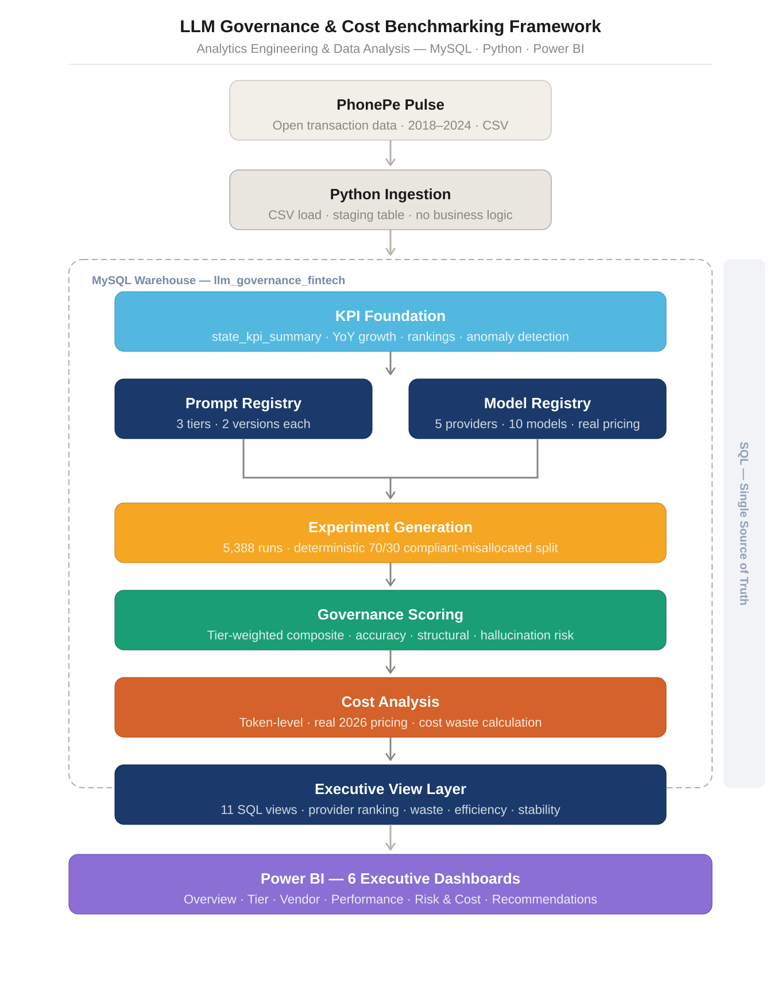
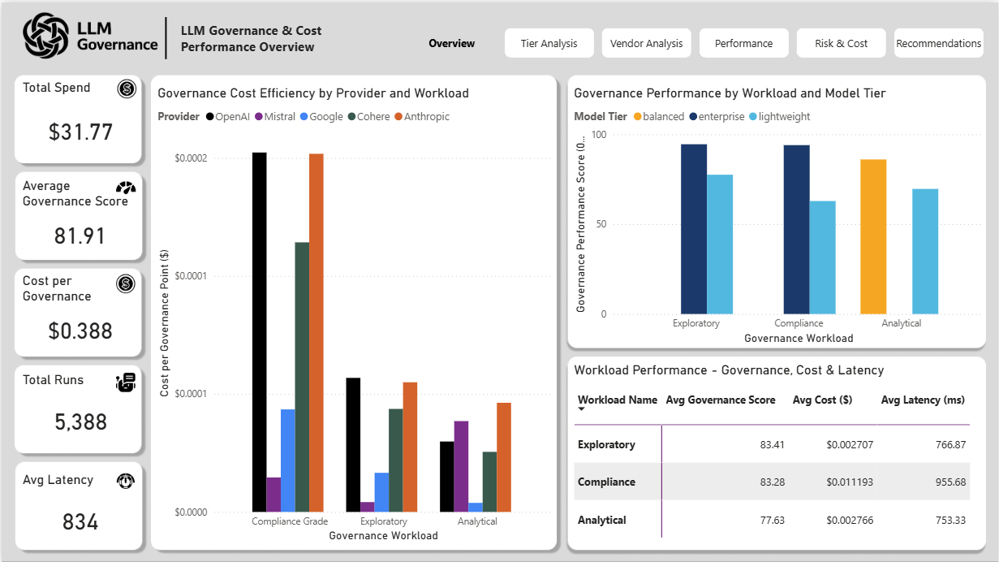
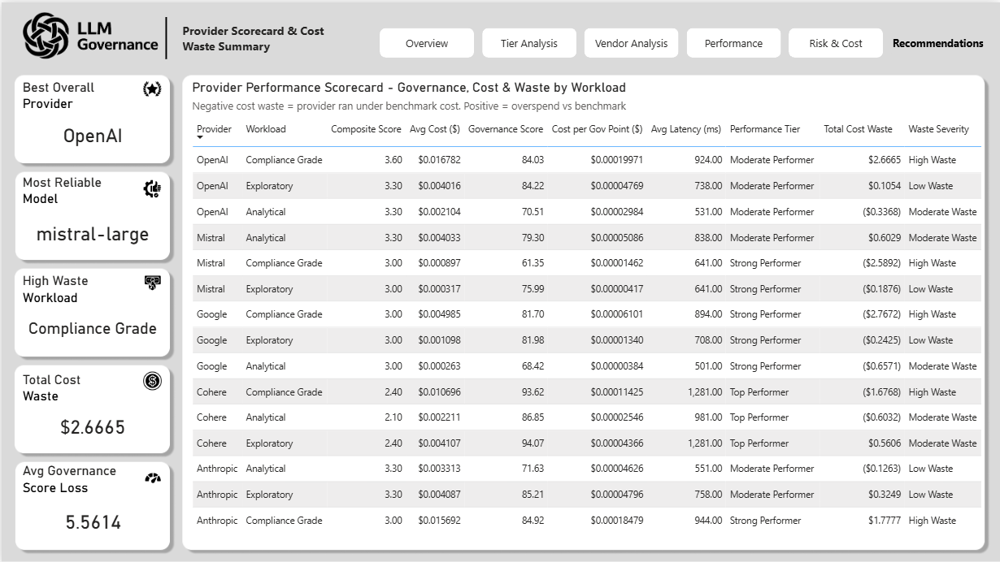

# LLM Governance & Cost Benchmarking Framework
**Analytics Engineering · Data Analysis · MySQL · Power BI · Python**

---

## The Problem

Organizations deploying LLMs for financial reporting face three problems they cannot currently measure — cost misallocation, output quality risk, and the absence of a structured decision framework for model selection.

This project builds the data infrastructure to measure all three and delivers a clear recommendation layer on top.

> Are we spending on the right models for the right jobs — and are those models producing output we can trust?

---

## What I Built

A SQL-first analytics engineering pipeline that benchmarks 5 LLM providers across 3 fintech governance workloads using real PhonePe Pulse transaction data. All business logic lives in MySQL. Power BI reads directly from SQL views — zero transformation.

---

## Architecture



---

## Tech Stack

| Layer | Tool | Role |
|---|---|---|
| Ingestion | Python | CSV load only — no business logic |
| Warehouse | MySQL | All KPI logic, scoring, cost calculation, views |
| Visualization | Power BI | 6-dashboard executive layer — zero transformation |

---

## Dashboards

**D1 — Overview**


**D5 — Risk & Cost**


**D6 — Recommendations**


---

## Key Findings

The biggest problem is not the vendor — it is the allocation policy.

- **50% misallocation rate** generates $2.67 in cost waste and 5.56 avg governance score loss per run
- **Cohere ranks #1** on governance quality (93.62) with lowest hallucination risk (7.3) — but slowest at 1,281ms
- **Mistral must be blocked from compliance workloads** — hallucination risk of 18.9 is 2.6x higher than Cohere
- **Anthropic is underrated** — second-lowest hallucination, strong governance, faster than Cohere at 791ms
- **OpenAI is best overall value** — consistent across all 3 workloads at mid-range cost
- **Lightweight tier has the best efficiency index** — more governance value per dollar than enterprise

---

## Recommendations

| Workload | Recommended Provider | Reason |
|---|---|---|
| Compliance Grade | Cohere or Anthropic | Cohere: lowest hallucination (7.3), highest governance (93.62). Anthropic: faster at 791ms when latency matters. |
| Analytical | OpenAI | Consistent governance across workloads at mid-range cost. |
| Exploratory | Google or Mistral | Fast, cheap, quality adequate for low-stakes queries. |

**Five actions:**
1. Enforce tier-workload governance policy — eliminates misallocation immediately
2. Block Mistral from compliance workloads — hallucination risk unacceptable for regulated reporting
3. Standardize Cohere or Anthropic for compliance grade
4. Use Google or Mistral for exploratory workloads
5. Monitor Mistral hallucination scores quarterly

---

## Database

| Table | Rows | Purpose |
|---|---|---|
| phonepe_transactions_staging | 5,034 | Raw PhonePe CSV — ingestion boundary |
| state_kpi_summary | 252 | Aggregated state-year KPIs |
| prompt_versions | 6 | 3 governance tiers × 2 versions |
| model_versions | 10 | 5 providers · real 2026 pricing |
| experiment_runs | 5,388 | Deterministic 70/30 compliant/misallocated split |
| evaluation_results | 5,388 | Tier-weighted composite governance scores |
| cost_analysis | 5,388 | Token-level cost · real pricing rates |

11 SQL views feed Power BI directly.

---

## Repo Structure

```
01_Data/            # PhonePe Pulse raw data
02_Architecture/    # Architecture diagram
03_Notebooks/       # Python ingestion scripts
04_SQL/             # Schema · seed · pipeline · views · validation
05_PowerBi/         # Power BI .pbix file
06_Documentation/   # 7 project documentation files
07_Insights/        # Insights and interpretation
08_Dashboard/       # Dashboard screenshots
```

---

## Documentation

Full project documentation in `06_Documentation/` — 6 files covering architecture, methodology, KPI definitions, and governance framework.
Insights and interpretation in `07_Insights/`.

---

*Analytics Engineering & Data Analysis Portfolio Project*
